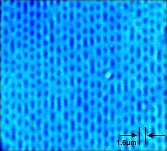

# 第一节 传统硬件进阶教程

## 3.1.1 光存储

### 3.1.1.1 光存储的分类

　　光存储的介质在正常情况下分为三大类，第一类是最初由飞利浦以及索尼共同提出的CD (Compact Disc), 第二类是由DVD联盟等提出的DVD (Digital Versatile Disc)，DVD分类最为混乱繁杂；而第三种便是BD (Blu-Ray Disc) , 即蓝光光盘。

　　下面按照分类列出常见光存储的光盘，如有疏漏请通过官方途径联系作者们。

| 光盘介质类型名称 | 光盘介质典型容量 | 光盘介质读取速度 | 光盘介质可被写入 | 光盘介质重复写入 | 光盘介质光源波长 光盘介质读取方式 | 备注 |
| :---: | :---: | :---: | :---: | :---: | :---: | :---: |
| CD-DA | 74m42s Audio | 1411kbps | 不可写入 | 不可写入 | 780nm CLV | PCM 16 Bit 44.1kHz Stereo |
| CD-ROM | 650 MB | 1x = 1200kbps | 不可写入 | 不可写入 | 780nm CLV | 无 |
| CD-R | 650 MB, 700 MB | 1x = 1200kbps | 可写入 | 不可重写 | 780nm CLV | 可改变CD写入参数最大写至 99min 或 900 MB |
| CD-RW | 650 MB , 700 MB | 1x = 1200kbps | 可写入 | 可重写入 | 780nm CLV | 可改变CD写入参数最大写至 99min 或 900 MB , 标称约可重复写入 1000 次附近 |
| DVD-ROM | 4.7 GB | 1x = 10.5Mbps | 不可写入 | 不可写入 | 650nm CAV* | 无 |
| DVD-R | 4.7 GB | 1x = 10.5Mbps | 可写入 | 不可重写 | 650nm CAV* | 无 |
| DVD-R DS | 9.4 GB | 1x = 10.5Mbps | 可写入 | 不可重写 | 650nm CAV* | 双面光盘，Double Side |
| DVD-R DL | 8.5 GB | 1x = 10.5Mbps | 可写入 | 不可重写 | 650nm CAV* | 双层光盘，Double Layer |
| DVD-RW | 4.7 GB | 1x = 10.5Mbps | 可写入 | 可重写 | 650nm CAV* | 标称约可重复写入 1000 次 |
| DVD-RAM | 4.7 GB | 1x = 10.5Mbps | 可写入 | 可重写 | 650nm CAV* | 标称约可重复写入 1000000 次 |
| DVD-RAM DS | 9.4 GB | 1x = 10.5Mbps | 可写入 | 可重写 | 650nm CAV* | 双面光盘，Double Side ，标称约可重复写入 1000000 次 |
| DVD+R | 4.7 GB | 1x = 10.5Mbps | 可写入 | 不可重写 | 650nm CAV* | 无 | 
| DVD+R DS | 9.4 GB | 1x = 10.5Mbps | 可写入 | 不可重写 | 650nm CAV* | 双面光盘，Double Side |
| DVD+R DL | 8.5 GB | 1x = 10.5Mbps | 可写入 | 不可重写 | 650nm CAV* | 双层光盘，Double Layer |
| DVD+RW | 4.7 GB | 1x = 10.5Mbps | 可写入 | 可重写 | 650nm CAV* | 标称约可重复写入 1000 次 |
| BD-R | 25 GB | 1x  = 36Mbps | 可写入 | 不可重写 | 405nm CAV* | 无 |
| BD-R DL | 50 GB | 1x = 36Mbps | 可写入 | 不可重写 | 405nm CAV* | 双层光盘，Double Layer |
| BD-R XL (TL) | 100 GB | 1x = 36Mbps | 可写入 | 不可重写 | 405nm CAV* | 三层光盘，Triple Layer |
| BD-R XL (QL) | 128 GB | 1x = 36Mbps | 可写入 | 不可重写 | 405nm CAV* | 四层光盘，Quad Layer |
| BD-RE | 25 GB | 1x = 36Mbps | 可写入 | 可重写 | 405nm CAV* | 标称约可重复写入 1000 次附近 |
| BD-RE DL | 50 GB | 1x = 36Mbps | 可写入 | 可重写 | 405nm CAV* | 双层光盘，Double Layer |
| BD-RE XL | 100 GB | 1x = 36Mbps | 可写入 | 可重写 | 405nm CAV* | 三层光盘，Triple Layer |

* DVD±R与BD采取的是CAV为主，p-CAV,z-CLV也有少量使用。

** CD 的实际最大速度为 56x , 即为 56 x 1200kbps = 67.2Mbps ; DVD 的实际最大速度为 24x , 即为 24 x 1.5Mbps = 36Mbps ; BD 的实际最大速度为 12x , 即为 12 x 36Mbps = 432Mbps . 由于在更大的读取速度中，光盘的结构不再能够稳定，可能会出现解体甚至爆裂。

#### 3.1.1.1.1 Compact Disc

　　Compact Disc ,或称 CD ,最初是设计为存储数字音频的一种介质。随着时间的推移，此技术也被用于记录数据资料，此版本的 CD 称之为 CD-ROM 。 CD-ROM 不可写入，只能读取。随后便推出了可被写入的 CD , 即 CD-R 与 CD-RW 。

　　CD 是由直径为 120 mm , 1.2 mm 的聚碳酸脂塑料构成，重 14 g 到 33 g 。其主要反射层由铝或在少量光盘上使用的的金构成，一般是直接旋涂到聚碳酸酯之上。其设计为可以容纳 74 min 的 CDDA 格式的未压缩立体数字音频或者大约 650 MiB 的数据。而其在实质上可以将容量提升至 80 min 或 700 MiB 、 90 min 或 800 MiB 甚至 99 min 或 870 MiB 。CD 记录数据的原理是在主反射层上的，每个凹坑的深度大约为 100 nm 附近，间距在 1.6 μm 附近，凹坑的长度并不决定了数据为高电平还是低电平，而是由不归零信号来表示。在读取时，一般将光盘旋转至 1.2 的恒定线速度 (CLV) 来读取数据，大约等于内圈 500 RPM ，外圈 200 RPM 。

#### 3.1.1.1.2 Digital Versatile Disc

    Digital Versatile Disc ,或称 DVD ，旧称 Digital Video Disc ，是接替了 CD 的下一代光盘   